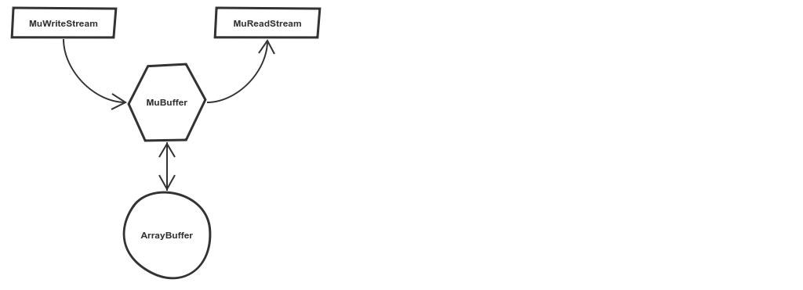

# mustream

Binary stream API for mudb

**UNDER CONSTRUCTION**

- [Why mustream](#why-mustream)
- [API and Example](#api-and-example)

## Why mustream
is cool:

- Simpler API, less code, faster to load
- More efficient access to binary data (with `ArrayBuffer`)
- Memory pool to minimize GC thrashing

## API and Example

A `MuWriteStream` and a `MuReadStream` both operate on a `MuBuffer`, a wrapper providing access to the underlying buffer. Take a look at [ArrayBuffer](https://developer.mozilla.org/en-US/docs/Web/JavaScript/Reference/Global_Objects/ArrayBuffer) first if you're not already familiar with it.

- `MuBuffer`
    - `mb.buffer`: an `ArrayBuffer`, the underlying binary buffer
    - `mb.dataView`: the `DataView` view of `buffer`
    - `mb.uint8`: the `Uint8Array` view of `buffer`
- `new MuWriteStream(capacity)`
    - `ws.buffer`: a `MuBuffer`, providing access to the underlying buffer
    - `ws.offset`: byte offset of the buffer
    - `ws.destroy()`: push `buffer` into memory pool
    - `ws.grow(capacity)`: grow `buffer` by `capacity`
    - `ws.writeInt8(value)`
    - `ws.writeInt16(value)`
    - `ws.writeInt32(value)`
    - `ws.writeUint8(value)`
    - `ws.writeUint16(value)`
    - `ws.writeUint32(value)`
    - `ws.writeFloat32(value)`
    - `ws.writeFloat64(value)`
    - `ws.writeString(value)`
- `new MuReadStream(muBuffer)`
    - `rs.buffer`: a `MuBuffer`, providing access to the underlying buffer
    - `rs.offset`: byte offset of the buffer
    - `rs.readInt8()`
    - `rs.readInt16()`
    - `rs.readInt32()`
    - `rs.readUint8()`
    - `rs.readUint16()`
    - `rs.readUint32()`
    - `rs.readFloat32()`
    - `rs.readFloat64()`
    - `rs.readString()`

[Here](src/test/write_read.ts) is how to play with mustream.

**TODO**

- bulk access to the underlying buffer

# credits
Development supported by Shenzhen DianMao Digital Technology Co., Ltd.

Written in Shenzhen, China.

(c) 2017 Mikola Lysenko, Shenzhen DianMao Digital Technology Co., Ltd.
